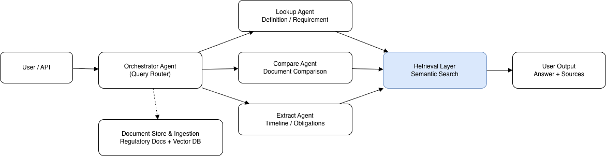

# RegDoc Agent

Agentic, citation-first Q&A over regulated documents (public/sanitized corpus).  
Focus: traceability, constrained answers, and controlled workflows — not “chatbot vibes”.

## What this is
RegDoc Agent helps users query rule-heavy documents (regulations, standards, guidance) and get:
- grounded answers based only on retrieved text
- citations for every key claim
- structured output (requirements, timelines, exceptions)

## What this is not
- Not legal/compliance advice
- Not connected to internal/proprietary documents
- Not a decision system
- Not a general web search bot

## Architecture (v1)
User → Orchestrator (router) → Task Agent → Retrieval Layer → Vector Store  
Task Agent → Guardrails/Formatter → Answer + Sources

## MVP Scope (January)
**Will do**
- document ingestion (public/sanitized)
- vector search + metadata filters
- cited answers
- simple agent routing (lookup / compare / extract)

**Won’t do (yet)**
- UI polish
- RBAC / enterprise auth
- production security hardening
- live external integrations

## Repo status
This is an early prototype and will evolve in phases:
- v1: skeleton + retrieval + citations
- v2: evaluation + failure modes
- v3: polish + packaging

## Quickstart (placeholder)
Coming soon.

## License
TBD (MIT recommended for public prototype).
